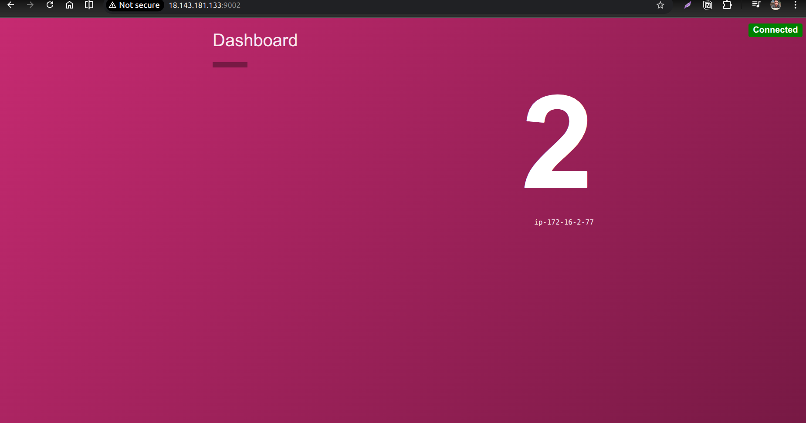

[Tue Mar 24]zinko@zinko-svr:~/pov-terraform/dashboard-counting-app-V2$ terraform apply --auto-approve

Outputs:

counting_private_ip = "172.16.2.77"
dashboard_public_ip = "18.143.181.133"
vpc_id = "vpc-0ad71b4831baa7c5d"
[Tue Mar 24]zinko@zinko-svr:~/pov-terraform/dashboard-counting-app-V2$ 

[Tue Mar 24]zinko@zinko-svr:~/pov-terraform/dashboard-counting-app-V2$ terraform state list
aws_key_pair.dashboard_counting_key_pair
local_file.ssh_private_key
tls_private_key.dashboard_counting_key
module.counting_ec2.data.aws_partition.current
module.counting_ec2.data.aws_ssm_parameter.this
module.counting_ec2.aws_instance.this[0]
module.counting_sg.aws_security_group.this_name_prefix[0]
module.counting_sg.aws_security_group_rule.egress_with_cidr_blocks[0]
module.counting_sg.aws_security_group_rule.ingress_with_cidr_blocks[0]
module.counting_sg.aws_security_group_rule.ingress_with_cidr_blocks[1]
module.counting_sg.aws_security_group_rule.ingress_with_cidr_blocks[2]
module.dashboard_counting_vpc.aws_default_network_acl.this[0]
module.dashboard_counting_vpc.aws_default_route_table.default[0]
module.dashboard_counting_vpc.aws_default_security_group.this[0]
module.dashboard_counting_vpc.aws_eip.nat[0]
module.dashboard_counting_vpc.aws_internet_gateway.this[0]
module.dashboard_counting_vpc.aws_nat_gateway.this[0]
module.dashboard_counting_vpc.aws_route.private_nat_gateway[0]
module.dashboard_counting_vpc.aws_route.public_internet_gateway[0]
module.dashboard_counting_vpc.aws_route_table.private[0]
module.dashboard_counting_vpc.aws_route_table.public[0]
module.dashboard_counting_vpc.aws_route_table_association.private[0]
module.dashboard_counting_vpc.aws_route_table_association.public[0]
module.dashboard_counting_vpc.aws_subnet.private[0]
module.dashboard_counting_vpc.aws_subnet.public[0]
module.dashboard_counting_vpc.aws_vpc.this[0]
module.dashboard_ec2.data.aws_partition.current
module.dashboard_ec2.data.aws_ssm_parameter.this
module.dashboard_ec2.aws_instance.this[0]
module.dashboard_sg.aws_security_group.this_name_prefix[0]
module.dashboard_sg.aws_security_group_rule.egress_with_cidr_blocks[0]
module.dashboard_sg.aws_security_group_rule.ingress_with_cidr_blocks[0]
module.dashboard_sg.aws_security_group_rule.ingress_with_cidr_blocks[1]
module.dashboard_sg.aws_security_group_rule.ingress_with_cidr_blocks[2]

